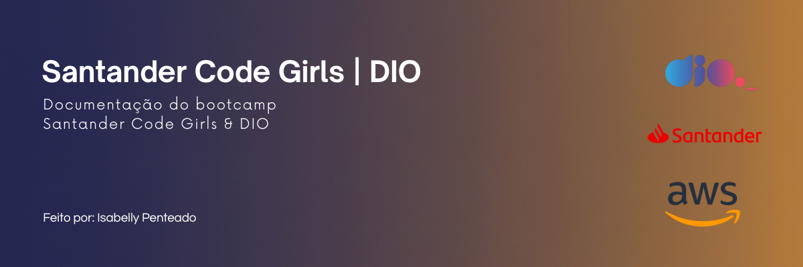

  
  
  
  

# Desafio de Projeto: Gerenciamento de Instâncias EC2 na AWS

Repositório criado para o Desafio de Projeto da [Digital Innovation One](https://www.dio.me/). O objetivo era consolidar os conhecimentos sobre o gerenciamento de instâncias EC2 no ambiente da Amazon Web Services (AWS), documentando o processo de forma clara e estruturada.

---

### ✨ Sobre o Projeto

Este projeto documenta o passo a passo prático para criar, configurar e gerenciar uma instância EC2 na AWS. Serve como um material de consulta e demonstração das competências adquiridas durante o bootcamp.

---

### 🎯 Objetivos de Aprendizagem Consolidados

- **Aplicação Prática:** Utilização do console da AWS para provisionar recursos.
- **Documentação Técnica:** Habilidade de documentar processos de forma clara e estruturada.
- **Versionamento com Git:** Uso do Git e GitHub para compartilhar e versionar a documentação.
- **Conceitos de Nuvem:** Entendimento de conceitos chave como Instâncias, Security Groups, Key Pairs e AMIs.

---

### 🛠️ Tecnologias e Ferramentas Utilizadas

- **Bootcamp:** 
- **Cloud Provider:** 
- **Versionamento:** 
- **Hospedagem de Código:** 

---

### 📖 Passo a Passo e Anotações

Todo o processo detalhado será documentado na pasta `anotações`.

➡️ **[Acesse as anotações completas aqui](./anotacoes/anotacoes)**

---

### 👨‍💻 Autor

Feito por **Isabelly Penteado**.