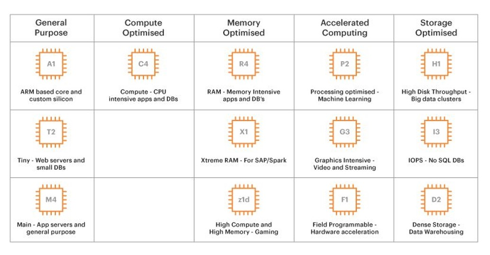
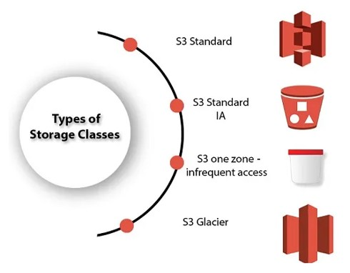
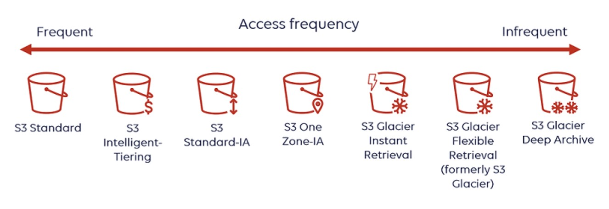
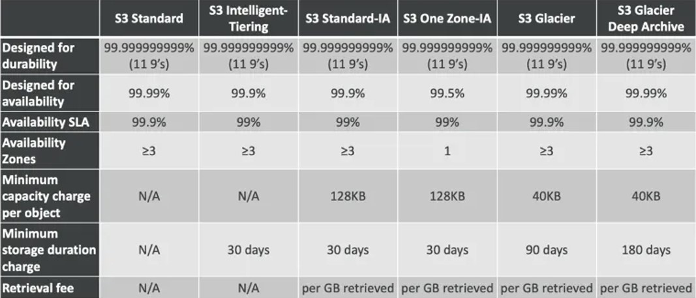
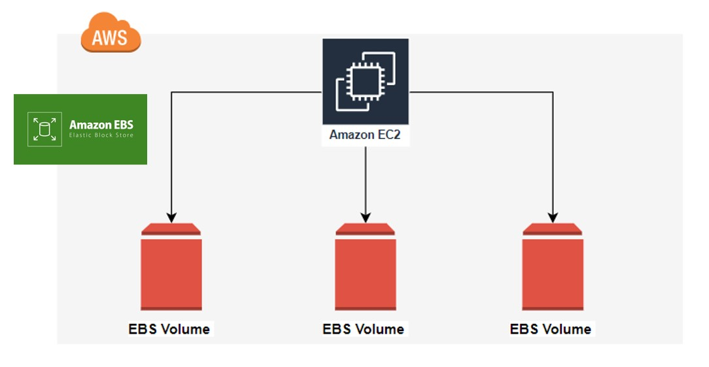
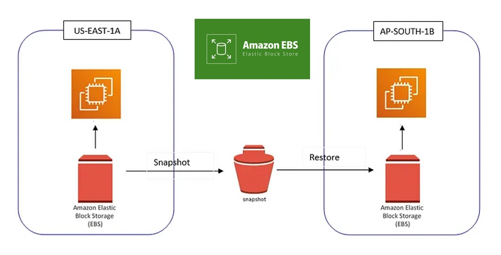
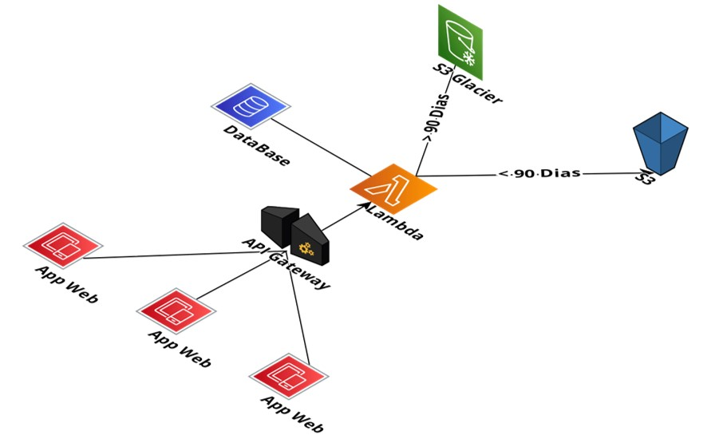

# 📝 Anotações de Estudo | AWS Cloud

Estas são as anotações e conceitos chave estudados durante o bootcamp **Santander Code Girls | DIO**, focados nos serviços essenciais da Amazon Web Services.

---

## ☁️ EC2 (Elastic Compute Cloud)

EC2 é o serviço de servidores virtuais na nuvem da AWS. Ele permite alugar e gerenciar servidores (conhecidos como instâncias) para rodar aplicações.

A AWS oferece diferentes famílias de instâncias, cada uma otimizada para um tipo específico de carga de trabalho, como computação, memória ou armazenamento.

- **Nomenclatura de Instâncias:** As instâncias seguem um padrão de nome, como `t3.large`, que indica:
  - **`t`**: Família da instância.
  - **`3`**: Geração da instância.
  - **`large`**: Tamanho da instância (poder computacional).

### Otimização e Custos

- **AWS Pricing Calculator:** Ferramenta essencial para fazer o orçamento e estimar os custos dos serviços na nuvem.
- **Otimização de Recursos:** A otimização de recursos leva à otimização de custos.
- **Modelo de Pagamento:**
  - Se a instância está em uso (`running`), você está pagando.
  - Se a instância está parada (`stopped`), você **não** está pagando pelo poder computacional, mas ainda pode pagar pelo armazenamento (EBS) associado a ela.
  - Se a instância está parada (`stopped`) e você desalocou/liberou os recursos, você **não** está pagando.

### Escalabilidade de Instâncias

A escalabilidade é a capacidade de ajustar os recursos computacionais conforme a necessidade.

- **Escalabilidade Vertical (Scale Up/Down):**
  - **O que é:** Aumentar ou reduzir a capacidade de um **único recurso**.
  - **Exemplo:** Alterar o tipo de uma instância EC2 (de `t2.micro` para `t2.large`) para adicionar mais CPU, memória ou capacidade de rede.

- **Escalabilidade Horizontal (Scale Out/In):**
  - **O que é:** Aumentar o **número de recursos**.
  - **Exemplo:** Adicionar mais instâncias EC2 para distribuir a carga de trabalho e suportar mais acessos à aplicação.

---

## 🛒 Tipos de Instâncias EC2

Existem diferentes modelos de precificação para as instâncias, cada um adequado a um tipo de necessidade.

1.  **Sob Demanda (On-Demand):**
    - **Preço:** Taxa fixa por hora ou segundo, sem compromisso a longo prazo.
    - **Uso Ideal:** Cargas de trabalho irregulares, de curto prazo, e para testes e desenvolvimento de aplicações.

2.  **Instâncias Reservadas (Reserved):**
    - **Preço:** Oferecem descontos significativos em comparação com o On-Demand, com o compromisso de uso por 1 ou 3 anos.
    - **Uso Ideal:** Aplicações com carga de trabalho previsível e constante.

3.  **Instâncias Spot:**
    - **Preço:** Oferecem os maiores descontos (até 90%), utilizando a capacidade computacional ociosa da AWS.
    - **Desvantagem:** A AWS pode encerrar essas instâncias a qualquer momento com um aviso de dois minutos, tornando-as ideais para cargas de trabalho que podem ser interrompidas.

---

## 🗄️ Serviços de Armazenamento

### Amazon S3 (Simple Storage Service)

- **O que é:** Serviço de armazenamento de **objetos** na nuvem, com altíssima disponibilidade (99.999999999%).
- **Lifecycle (Ciclo de Vida):** Possui um ciclo de vida de 4 etapas para otimizar custos, movendo objetos para classes de armazenamento mais baratas ao longo do tempo.
- **Amazon S3 Glacier:** Classe de armazenamento de baixo custo para arquivamento e backup de longo prazo. É o último passo do ciclo de vida.
  - Se estiver a < 90 dias ele estará no S3 e se estiver a > 90 dias ele vai estar no Glacier.

  As classes de armazenamento do S3 permitem otimizar os custos com base na frequência de acesso aos dados.

O espectro de acesso vai desde dados acessados frequentemente (S3 Standard) até dados de arquivamento raramente acessados (S3 Glacier Deep Archive).

A tabela abaixo detalha as características técnicas de cada classe, como durabilidade, disponibilidade e taxas de recuperação.

### Amazon EBS (Elastic Block Store)

- **O que é:** Serviço que fornece volumes de armazenamento em bloco de alta performance, funcionando como um "HD externo" para as instâncias EC2.
- **Anexação:** Pode ser anexado a qualquer instância EC2 para expandir a capacidade de armazenamento de forma rápida.
- **Casos de Uso:**
  - Armazenar bancos de dados (como MySQL).
  - Armazenar arquivos de aplicações web.

Este diagrama ilustra como uma instância EC2 principal pode se conectar e utilizar múltiplos volumes EBS para diferentes necessidades de armazenamento.

---

## 💿 Imagens e Backups

### AMI (Amazon Machine Image)

- **O que é:** Uma "réplica" ou modelo de uma instância EC2. A AMI inclui o sistema operacional, o servidor de aplicação e todas as configurações necessárias.
- **Uso Principal:** Permite criar e iniciar rapidamente novas instâncias com configurações pré-definidas, facilitando a replicação de ambientes.
- **Criação:** AMIs podem ser criadas a partir de instâncias que estão em execução ou paradas.
- **Tipos:**
  - **Públicas:** Fornecidas pela AWS e pela comunidade.
  - **Privadas:** Criadas por você para garantir segurança e personalização.

### Snapshot com EBS

- **EBS faz parte do IaaS (Infraestrutura como Serviço).**
- **Snapshot:** É um serviço de backup nativo da AWS que cria uma cópia de segurança de um volume EBS em um determinado momento.
- **Armazenamento:** Os snapshots são armazenados de forma incremental no Amazon S3.
- **Frequência:** É possível configurar a frequência com que os snapshots são tirados.

O fluxo de um Snapshot de EBS demonstra sua flexibilidade e importância para a resiliência. Um backup de um volume em uma Zona de Disponibilidade (ex: US-EAST-1A) pode ser usado para restaurar os dados em uma nova Zona (ex: AP-SOUTH-1B).

### Diferença: AMI vs. Snapshot

- **AMI:** É um "backup" do **servidor inteiro**, incluindo todos os volumes EBS anexados. É um modelo para criar novas instâncias.
- **Snapshot:** É uma cópia pontual de um **volume EBS específico**. É um backup de um "disco" individual, que pode ser usado para restaurar esse disco ou criar novos volumes.

---
### 🏛️ Diagrama da Arquitetura EC2

O diagrama abaixo ilustra a arquitetura do desafio com EC2, mostrando a relação entre o usuário, a instância, os volumes EBS e o RDS.

### 🏛️ Diagrama da Arquitetura S3 e Lambda

Este diagrama mostra um fluxo de trabalho orientado a eventos, onde um arquivo enviado ao S3 aciona uma função Lambda que processa e armazena os dados no DynamoDB.

## (Bônus) Exemplo de Arquitetura Serverless na AWS

Este diagrama ilustra uma arquitetura mais avançada e orientada a eventos, utilizando serviços gerenciados da AWS. Aplicações web se conectam a um **API Gateway**, que aciona funções **Lambda**. A função Lambda, por sua vez, pode interagir com um banco de dados (DataBase) e tomar decisões de armazenamento de dados no S3, movendo-os para o S3 Glacier conforme o tempo de vida definido (ex: > 90 dias).

